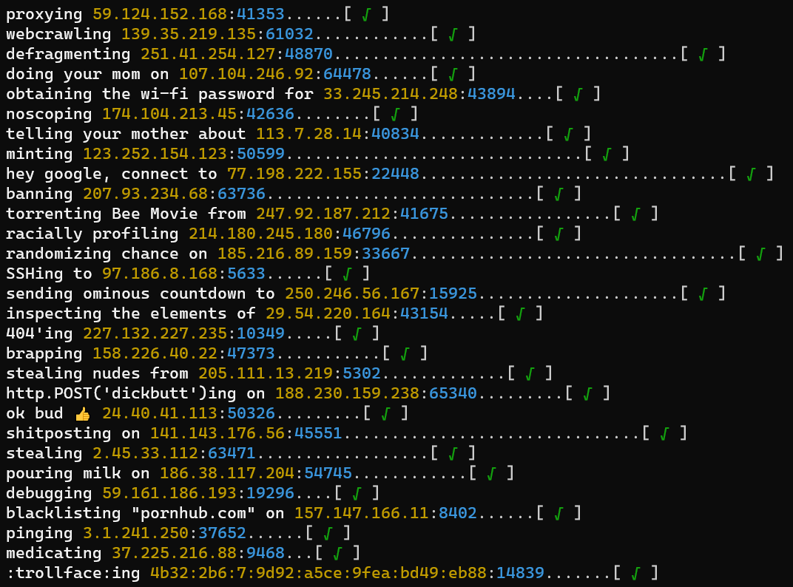

# ipaddrgen 👩‍💻
### the funny ip address generator

a small cli program written in go that generates random ip addresses and "does things" to them.

**Q:** *"why would you make this?"*

**A:** I was very bored.

*legal disclaimer: no this isn't a "hacking" tool, it's a goofy piece of software that spits text out onto the screen and nothing more. I wholeheartedly encourage that this software be used in le funny hacking montage.*

# screenies 📸

# build 📀

### requirements:

- [go](https://go.dev/) (currently using 1.17.6)
- that's about it

### how:

windows: `go build -o ./bin/ipaddrgen.exe ./src`

linux/mac: `go build -o ./bin/ipaddrgen ./src`

*alternatively, just run it with `go run ./src`*

---

enjoy! ❤
